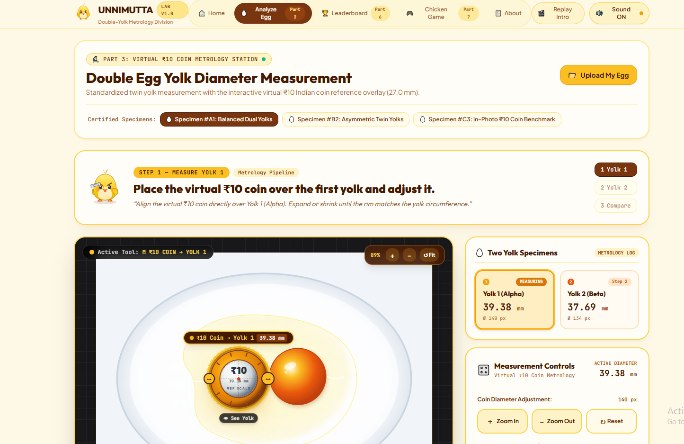
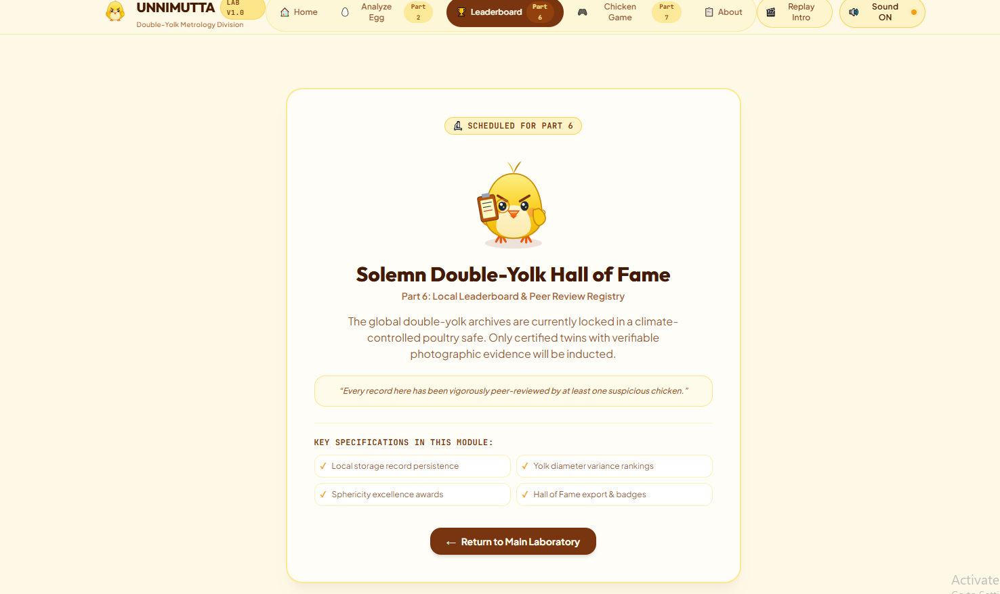

UNNIMUTTA 🥚🐔

The unnecessarily serious double-yolk analyzer.

---

🎯 Basic Details

Team Name: VELTRIX

Team Members

- Team Leader: MALAVIKA PRAKASH  - MAR BASELIOUS CHRISTIAN COLLEG OF ENGINEERING AND TECHNOLOGY,PEERMADE
- Member 2: FATHIMA ANSHAD -  MAR BASELIOUS CHRISTIAN COLLEG OF ENGINEERING AND TECHNOLOGY,PEERMADE
  

---

🥚 Project Description

Unnimutta is a completely unnecessary web application built to answer one extremely important question: Are the two yolks of a double-yolk egg actually the same size?

Users can upload or capture an egg image, use a virtual ₹10 coin as a reference, measure both yolks, compare their approximate diameters, earn achievements, unlock a chicken dance, and compete on a local leaderboard.

Important research. Probably.

---

🤡 The Problem (that doesn't exist)

Double-yolk eggs exist.

But nobody knows whether their two yolks are exactly the same size.

This created a completely unnecessary scientific crisis.

So we decided to solve a question that absolutely nobody was asking:

«“Are the two yolks the same diameter?”»

Because apparently, this needed a website.

---

🐔 The Solution (that nobody asked for)

Unnimutta turns this completely unnecessary question into an interactive experience.

Users can:

1. Upload an egg photograph or capture one using their camera.
2. Receive an entertaining Egg Documentation Score.
3. Open the measurement workspace.
4. Place a virtual ₹10 coin reference over each yolk.
5. Drag, resize and position the reference.
6. Calculate an approximate yolk diameter.
7. Measure both yolks.
8. Compare their sizes.
9. Receive an unnecessarily dramatic result.
10. Unlock achievements.
11. Make a chicken dance.
12. Save their result locally.
13. Compete on a fictional/local leaderboard.
14. Play the Chicken Clicker Trap.

The project is intentionally designed as a fun experiment rather than a serious scientific instrument.

---

🛠️ Technical Details

Technologies / Components Used

For Software

Languages

- TypeScript
- JavaScript
- HTML / JSX
- CSS

Frameworks

- Next.js
- React

Styling

- Tailwind CSS

Libraries / UI

- Base UI
- Class Variance Authority
- Utility functions for class-name management

Browser Technologies

- File upload
- Camera / webcam access
- LocalStorage
- Browser audio
- Mouse interaction
- Touch interaction
- Image handling
- Frontend animations

Development & Deployment Tools

- v0
- Git
- Vercel

For Hardware

No hardware is required.

Unnimutta is completely software-based and runs in a modern web browser.

---

⚙️ Implementation

For Software

Installation

Clone the project:

git clone [Repository URL]

Enter the project directory:

cd Unnimutta

Install dependencies:

pnpm install

If pnpm is not installed:

npm install -g pnpm

Then run:

pnpm install

---

▶️ Run

Start the development server:

npm dev

Open the local development URL shown in the terminal, usually:

http://localhost:3000

---

📚 Project Documentation

🧭 Workflow

                 UNNIMUTTA
                     │
                     ▼
             Intro Animation
                     │
                     ▼
             Upload / Camera
                     │
                     ▼
          Egg Documentation Score
                     │
                     ▼
           Measurement Workspace
                     │
             ┌───────┴───────┐
             ▼               ▼
        Yolk 1            Yolk 2
             │               │
             └───────┬───────┘
                     ▼
              Compare Diameters
                     │
              ┌──────┴──────┐
              ▼             ▼
          Same Size      Different
              │             │
              ▼             ▼
        Dramatic Result   Funny Result
              │
              ▼
         Achievements
              │
              ▼
        Chicken Dance
              │
              ▼
        Local Leaderboard
              │
              ▼
        Chicken Clicker Trap

Caption: Complete user journey from entering Unnimutta to uploading an egg, measuring its yolks, comparing the results and interacting with the gamification features.

---

📸 Screenshots

1. Landing Page

![Homepage]

Caption: The Unnimutta landing page featuring the yellow-and-white visual theme, playful chicken mascot and introductory experience.

---

2. Egg Measurement Workspace

Caption: The interactive measurement workspace where users position and resize the virtual ₹10 reference over the yolks.

---

3. Results / Leaderboard

Caption: The results interface displaying yolk measurements, comparison results, achievements and leaderboard information.

---

🥚 Yolk Measurement

The virtual ₹10 coin acts as the reference object.

The system uses an approximate reference diameter of 27 mm for the coin.

The approximate yolk diameter is calculated using:

Real Yolk Diameter
=
Yolk Pixel Diameter
÷
Reference Pixel Diameter
×
27 mm

Users can move and resize the virtual reference to match the physical scale in the uploaded image.

The result is presented as an approximate visual measurement, not a laboratory-grade measurement.

«This is an approximate visual measurement based on image scale and the ₹10 reference. It is not a laboratory measurement.»

---

🏆 Gamification

Unnimutta turns yolk measurement into a game.

Users can receive:

- Egg Documentation Score
- Achievements
- Perfect Ratio recognition
- Leaderboard positions
- Chicken Dance celebration
- Chicken Clicker Trap scores

Perfect Yolk Ratio

When the two measured yolks are considered equal, Unnimutta responds with an unnecessarily serious celebration.

«“Two yolks. One destiny.”»

Confetti, sound effects and the chicken mascot help make the result intentionally dramatic.

If the yolks are different, the chicken reacts accordingly with humorous expressions.

---

🐔 Chicken Dance

After completing the egg analysis, users can unlock a virtual chicken dance.

The chicken can:

- Flap its wings
- Bounce
- Move side-to-side
- Wiggle
- Celebrate

The dance acts as a reward for completing the analysis.

---

🏆 Local Leaderboard

Unnimutta uses browser LocalStorage for its leaderboard.

Stored information can include:

- Username
- Egg score
- Yolk 1 diameter
- Yolk 2 diameter
- Ratio
- Achievement
- Date
- Game score
- Egg image thumbnail

No traditional backend or database is required for the local leaderboard.

---

🎮 Chicken Clicker Trap

Unnimutta includes a dedicated mini-game called:

🐔 CHICKEN CLICKER TRAP

The game is intentionally separated from the main egg analyzer so its mechanics can be expanded independently.

---

🔊 Sound & Animation

Unnimutta uses optional sound effects and frontend animations throughout the experience.

The opening animation follows this sequence:

Cute chick
    ↓
Picks up tennis racket
    ↓
Hits egg
    ↓
Egg flies toward screen
    ↓
Yellow acrylic-paint splash
    ↓
Main website appears

Sound effects can accompany important interactions such as:

- Egg impact
- Measurement confirmation
- Equal-yolk result
- Different-yolk result
- Achievement unlock
- Chicken dance
- Game interactions

The website remains usable when sound is disabled.

---

🐥 Chicken Mascot

The yellow chicken mascot appears throughout the website with different expressions.

Possible expressions include:

- Happy
- Serious
- Confused
- Shocked
- Proud
- Disappointed
- Scientist
- Dancing

The mascot helps maintain the playful personality of Unnimutta.

---

🗂️ Project Structure

Unnimutta/
│
├── app/
│   ├── layout.tsx
│   ├── page.tsx
│   └── globals.css
│
├── components/
│   ├── analyzer.tsx
│   ├── app-context.tsx
│   ├── chick-mascot.tsx
│   ├── chicken-dance.tsx
│   ├── clicker-trap.tsx
│   ├── comparison-result.tsx
│   ├── egg-gallery.tsx
│   ├── egg-score.tsx
│   ├── egg-uploader.tsx
│   ├── egg.tsx
│   ├── intro-animation.tsx
│   ├── leaderboard.tsx
│   ├── measurement-tool.tsx
│   ├── navbar.tsx
│   └── sound-toggle.tsx
│
├── lib/
│   ├── achievements.ts
│   ├── demo-data.ts
│   ├── measurement.ts
│   ├── scoring.ts
│   ├── sound.ts
│   ├── storage.ts
│   ├── types.ts
│   └── utils.ts
│
├── public/
│
├── package.json
├── next.config.mjs
├── tsconfig.json
├── pnpm-lock.yaml
└── README.md

---

🏗️ Architecture

              ┌───────────────────┐
              │     Next.js       │
              │     Application   │
              └─────────┬─────────┘
                        │
                ┌───────▼───────┐
                │     React     │
                │   Components  │
                └───────┬───────┘
                        │
       ┌────────────────┼────────────────┐
       ▼                ▼                ▼
   Egg Upload      Measurement      Gamification
       │                │                │
       ▼                ▼                ▼
 Camera/File       Virtual ₹10       Achievements
                   Reference         Chicken Dance
       │                │                │
       └────────────────┼────────────────┘
                        ▼
                  LocalStorage
                        │
                        ▼
                 Browser Storage

Caption: Unnimutta is primarily a client-side web application. The user interface, measurement logic, scoring, animations, sound and gamification run in the browser, while LocalStorage provides local persistence.

---

🎥 Project Demo

Video

[Add your demo video link here]

Description: The video demonstrates the complete Unnimutta experience, from the opening animation and egg upload through yolk measurement, comparison, results, achievements, chicken dance, leaderboard and mini-game.

---

---

👥 Team Contributions

MALAVIKA PRAKASH

- Project concept and problem definition
- UI/UX design

- Egg analyzer
- Leaderboard
- Testing and presentation

 FATHIMA ANSHAD
- Frontend development
- Mesurement functionality
- Virtual reference interaction
- Testing and debugging
- Documentation
- Chicken Clicker Trap

Update these sections according to the actual contributions of each team member.

---

🥚 Why Unnimutta?

Because some questions are too important to ignore.

Are two yolks really the same size?

We don't know.

But now we have a website for it

UNNIMUTTA — Important research. Probably.
